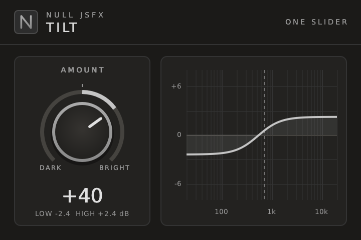

# NULL Tilt Native (DPF prototype)

A native VST3 and CLAP build of `DATA/Effects/null_jsfx/tilt.jsfx`, made with
[DPF](https://github.com/DISTRHO/DPF) (ISC). The plugin code is MIT, like the rest of the suite.



| | |
|---|---|
| Name / maker | NULL Tilt Native / NULL JSFX, https://nulljsfx.tech |
| Version | 2.0.0 |
| CLAP id | `tech.nulljsfx.tilt-native` (features: audio-effect, equalizer, stereo) |
| VST3 | category `Fx\|EQ\|Stereo`; class id made by DPF from brand `NulJ` + unique id `NTlt` |
| I/O, latency | stereo in and out, zero latency |
| Parameter | Amount, -100 to +100, default 0 |

## DSP

The DSP matches the JSFX exactly. It runs in double precision, like EEL2. See `plugin/TiltDSP.hpp`.

```
c = exp(-2*pi*700/sr);  lp = (1-c)*x + c*lp
y = lp * 10^(-t*6/20) + (x - lp) * 10^(t*6/20),   t = Amount/100
```

The only change from the JSFX is a gain glide with a 10 ms time constant, so automation does not
cause zipper noise. The glide snaps to the exact target gains once it is within 1e-9, and
`activate()` jumps straight to the target. When the parameter is not moving, the output is
**bit-identical** to the JSFX.

## Layout

```
CMakeLists.txt          Fetches DPF at a pinned SHA with FetchContent, then calls dpf_add_plugin()
plugin/DistrhoPluginInfo.h
plugin/PluginTilt.cpp   DPF Plugin wrapper
plugin/TiltDSP.hpp      Framework-free DSP and magnitude-response maths (shared by the UI and the test)
plugin/UITilt.cpp       NanoVG UI, 360x240, scales automatically for HiDPI
plugin/Theme.hpp        nulljsfx.tech palette with a silver accent (matches gfx/null_gfx.jsfx-inc)
test/compare_tilt.cpp   Sample-by-sample comparison: ysfx(JSFX) vs CLAP (dlopen) vs DSP class
scripts/build.sh        One build script for Linux, macOS and Windows (Git Bash), also used by CI
(CI: the repository workflow .github/workflows/prototypes.yml builds this on all three OSes)
screenshots/            UI captured under Xvfb from the JACK standalone build
```

The font is DejaVu Sans, which DPF embeds (`NanoVG::loadSharedResources()`, Bitstream Vera/DejaVu
licence). The plugin does not read any font file at runtime.

## Building

```sh
scripts/build.sh            # Release, VST3 + CLAP with GUI -> build/bin/, dist/null-tilt-native-<os>.zip
scripts/build.sh --test     # also runs the JSFX comparison (Linux/macOS; builds ysfx via tests/run.sh if needed)
scripts/build.sh --no-ui    # headless DSP-only build (no X11/GL headers needed)
scripts/build.sh --dpf DIR  # offline: use a local DPF checkout (it needs the dgl/src/pugl-upstream submodule)
```

CMake options: `NULLTILT_UI` (ON), `NULLTILT_VST3` (ON), `NULLTILT_CLAP` (ON), `NULLTILT_LV2`
(OFF), `NULLTILT_VST2` (OFF), `NULLTILT_JACK` (OFF; the standalone, used for screenshots),
`NULLTILT_TESTS` (OFF).

DPF is pinned to `4238e1c7f0351bbe488d79f0899c540543ac7583` (main, 2025-10-23). CMake fetches it
together with its pugl submodule.

### Dependencies per OS

| OS | Packages |
|---|---|
| Linux (Ubuntu 22.04/24.04) | `build-essential cmake ninja-build pkg-config git libx11-dev libxext-dev libxrandr-dev libxcursor-dev libgl1-mesa-dev libdbus-1-dev` |
| macOS (13+, universal arm64+x86_64, deployment target 10.13) | Xcode Command Line Tools, `cmake` (optional: `ninja`) |
| Windows (x64) | Visual Studio 2022 (MSVC, "Desktop development with C++"), CMake 3.15 or newer, Git for Windows (bash) |

The test also needs ysfx, which the repo's `tests/run.sh` builds. On Windows the test is skipped
because it uses `dlopen`. The DSP is plain C++ and identical on every OS.

### Screenshot recipe (Linux)

```sh
apt-get install xvfb jackd2 xdotool imagemagick
cmake -S . -B build-jack -DNULLTILT_JACK=ON -DNULLTILT_VST3=OFF -DNULLTILT_CLAP=OFF && cmake --build build-jack
Xvfb :77 & export DISPLAY=:77
jackd -d dummy -r 48000 & ./build-jack/bin/null_tilt_native &
xdotool windowsize "$(xdotool search --name "Tilt Native")" 720 480   # 2x; the UI scales itself
import -window "$(xdotool search --name "Tilt Native")" shot.png
```

## Known limitations

- At this DPF pin, the CLAP descriptor leaves `version` and `url` empty (a DPF TODO). VST3 reports
  the version correctly.
- The VST3 bundle has no `moduleinfo.json`. This is optional, and hosts scan the bundle without it.
